# How eBay paid for my home automation

> *“One’s destination is never a place, but a new way of seeing things.”* Quote: Henry Miller

To pursue home automation is to go on a journey of discovery. A journey that cannot be planned, but explored as the land reveals itself before you.

My own journey started with frustration.  Frustration that I had, over the years, purchased an odd collection of components which could be controlled remotely through their own app or by their own proprietary remote control, but not work together in any consistent way. Each device came with its own bug-ridden app, which worked entirely differently to any other app. They were all built around some kind of *standard*, but none of those *standards*  worked together.  Very, very frustrating!

Some of the devices worked with IFTTT, so I could at least get a few lights to go on and off on a schedule, but it was hardly impressive stuff.

But I digress from the point of this blog entry: ***How eBay paid for my home automation.***

On this road to home automation, I was aghast at the cost of some products, particularly proprietary gateways that provided access to proprietary protocols to control a specific company's products.  In my own mind, such expense seemed like an extravagance, particularly as I possessed perfectly good remote controls or phone apps that already controlled the products.  

However, one such gateway made the remote controllers that were supplied with the product redundant.  So, I advertised two of them on eBay and was amazed at how quickly they got snapped up.  That started me on a selling frenzy;  I would sell anything that had become redundant.  I would search the loft for old kit I had not used in years and advertise it on eBay.  I even sold an old Sony radio with a proprietary Apple iPhone 3 charger on the front (yes THAT old!!!).  People it seems, will buy anything that is well advertised. 
I even started buying things advertised badly and selling them again for a profit. 

I was often dispatching several items per day. At the height of the selling frenzy, I dispatched 16 items in one day!  

In the end, my eBay sales of £1,187 very nearly matched my overall expenditure of £1,520  on home automation equipment (see table below).  The big money makers were old A/V equipment, made redundant by cheaper, more functional units, and the sale of four remote  controls made redundant by a single gateway.  If it were not for the purchase of an entirely new heating system, my overall expenditure would be near the break-even point.

Who else can claim they gave their apartment an entire technology refresh for £332?

My home automation journey has not been without its traps, dead ends, diversions, and monsters.  For example, the table below excludes £428 of items which were returned to Amazon because they were complete rubbish!  

<table class="blueTable">
  <thead>
    <tr>
      <th>Category</th>
      <th>Quantity</th>
      <th>Total Sales</th>
      <th>Total Purchases</th>
      <th>Difference</th>
    </tr>
  </thead>
  <tbody>
    <tr>
      <td style="text-align: left">Audio / Visual</td>
      <td style="text-align: right">20</td>
      <td style="text-align: right">£491</td>
      <td style="text-align: right">£120</td>
      <td style="text-align: right" class="green">Profit: £371</td>
    </tr>
    <tr>
      <td style="text-align: left">Heating Control</td>
      <td style="text-align: right">9</td>
      <td style="text-align: right">£67</td>
      <td style="text-align: right">£383</td>
      <td style="text-align: right" class="pink">Cost: £316</td>
    </tr>
    <tr>
      <td style="text-align: left">Home Automation Device</td>
      <td style="text-align: right">32</td>
      <td style="text-align: right">£133</td>
      <td style="text-align: right">£573</td>
      <td style="text-align: right" class="pink">Cost: £439</td>
    </tr>
    <tr>
      <td style="text-align: left">Home Automation Hub Kit</td>
      <td style="text-align: right">5</td>
      <td style="text-align: right">£49</td>
      <td style="text-align: right">£208</td>
      <td style="text-align: right" class="pink">Cost: £159</td>
    </tr>
    <tr>
      <td style="text-align: left">Network Infrastructure</td>
      <td style="text-align: right">8</td>
      <td style="text-align: right">£39</td>
      <td style="text-align: right">£7</td>
      <td style="text-align: right" class="green">Profit: &nbsp;£32</td>
    </tr>
    <tr>
      <td style="text-align: left">Miscellaneous Items</td>
      <td style="text-align: right">4</td>
      <td style="text-align: right">£107</td>
      <td style="text-align: right">-</td>
      <td style="text-align: right" class="green">Profit: £107</td>
    </tr>
    <tr>
      <td style="text-align: left">Velux Window Control</td>
      <td style="text-align: right">5</td>
      <td style="text-align: right">£299</td>
      <td style="text-align: right">£226</td>
      <td style="text-align: right" class="green">Profit: &nbsp;£72</td>
    </tr>
    <tr>
      <td style="text-align: left">Grand Total</td>
      <td style="text-align: right">83</td>
      <td style="text-align: right">£1,187</td>
      <td style="text-align: right">£1,520</td>
      <td style="text-align: right" class="pink">Cost: £332</td>
    </tr>
  </tbody>
</table>

## The Assistant’s voice in the wilderness

> *Google Nest Mini purchased 26th Oct 2019 – Still on the journey*

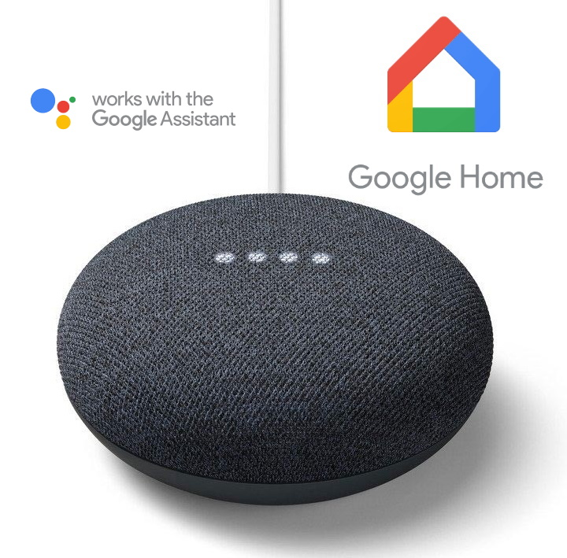

I had lived with the hotchpotch world of badly coordinated equipment for two years or so before the acquisition of a Google Nest Mini sparked my interest in home automation.  It was then that I took a fresh look at integrating the various devices I already had and put together an Excel spreadsheet (reproduced below) which listed how they were controlled.

Google Home would only control the Belkin smart plugs and the Logitech Harmony Hub.  However, the Harmony Hub integration was a little pointless as it only allowed the device (TV, Blu-ray etc.) to be switched on or off.  Essentially, at this point Google Assistant was a voice in the wilderness; unable to control anything of significance.

<table class="blueTable">
  <thead>
    <tr>
      <th>Category</th>
      <th>Item</th>
      <th>Qty</th>
      <th>Own App</th>
      <th>Own Remote</th>
      <th>Own Website</th>
      <th>Google Home</th>
    </tr>
  </thead>
  <tbody>
    <tr>
      <td style="text-align: left">Audio / Visual</td>
      <td style="text-align: left">Logitech Harmony Hub</td>
      <td style="text-align: center">1</td>
      <td style="text-align: center" class="green">✔</td>
      <td style="text-align: center" class="green">✔</td>
      <td style="text-align: center" class="pink">✘</td>
      <td style="text-align: center" class="green">✔</td>
    </tr>
    <tr>
      <td style="text-align: left">Audio / Visual</td>
      <td style="text-align: left">Logitech Squeezebox Touch</td>
      <td style="text-align: center">4</td>
      <td style="text-align: center" class="green">✔</td>
      <td style="text-align: center" class="pink">✘</td>
      <td style="text-align: center" class="green">✔</td>
      <td style="text-align: center" class="pink">✘</td>
    </tr>
    <tr>
      <td style="text-align: left">Heating</td>
      <td style="text-align: left">Salus iT550 Controller</td>
      <td style="text-align: center">1</td>
      <td style="text-align: center" class="green">✔</td>
      <td style="text-align: center" class="pink">✘</td>
      <td style="text-align: center" class="green">✔</td>
      <td style="text-align: center" class="pink">✘</td>
    </tr>
    <tr>
      <td style="text-align: left">Lights</td>
      <td style="text-align: left">MiLight LED controllers</td>
      <td style="text-align: center">3</td>
      <td style="text-align: center" class="green">✔</td>
      <td style="text-align: center" class="green">✔</td>
      <td style="text-align: center" class="pink">✘</td>
      <td style="text-align: center" class="pink">✘</td>
    </tr>
    <tr>
      <td style="text-align: left">Plugs</td>
      <td style="text-align: left">Belkin smart plugs</td>
      <td style="text-align: center">3</td>
      <td style="text-align: center" class="green">✔</td>
      <td style="text-align: center" class="pink">✘</td>
      <td style="text-align: center" class="pink">✘</td>
      <td style="text-align: center" class="green">✔</td>
    </tr>
    <tr>
      <td style="text-align: left">Security</td>
      <td style="text-align: left">Risco Security Alarm</td>
      <td style="text-align: center">1</td>
      <td style="text-align: center" class="green">✔</td>
      <td style="text-align: center" class="pink">✘</td>
      <td style="text-align: center" class="green">✔</td>
      <td style="text-align: center" class="pink">✘</td>
    </tr>
    <tr>
      <td style="text-align: left">Windows / Blinds</td>
      <td style="text-align: left">Velux Integra windows</td>
      <td style="text-align: center">5</td>
      <td style="text-align: center" class="pink">✘</td>
      <td style="text-align: center" class="green">✔</td>
      <td style="text-align: center" class="pink">✘</td>
      <td style="text-align: center" class="pink">✘</td>
    </tr>
    <tr>
      <td style="text-align: left">Windows / Blinds</td>
      <td style="text-align: left">Velux Integra blinds</td>
      <td style="text-align: center">5</td>
      <td style="text-align: center" class="pink">✘</td>
      <td style="text-align: center" class="green">✔</td>
      <td style="text-align: center" class="pink">✘</td>
      <td style="text-align: center" class="pink">✘</td>
    </tr>
    <tr>
      <td style="text-align: left">Windows / Blinds</td>
      <td style="text-align: left">Somfy Huna Blinds</td>
      <td style="text-align: center">3</td>
      <td style="text-align: center" class="green">✔</td>
      <td style="text-align: center" class="green">✔</td>
      <td style="text-align: center" class="pink">✘</td>
      <td style="text-align: center" class="pink">✘</td>
    </tr>
  </tbody>
</table>
 
## Dead-end in Tahoma

> *Somfy Tahoma hub purchased 7th Nov 2019 – Returned after 24 hours*

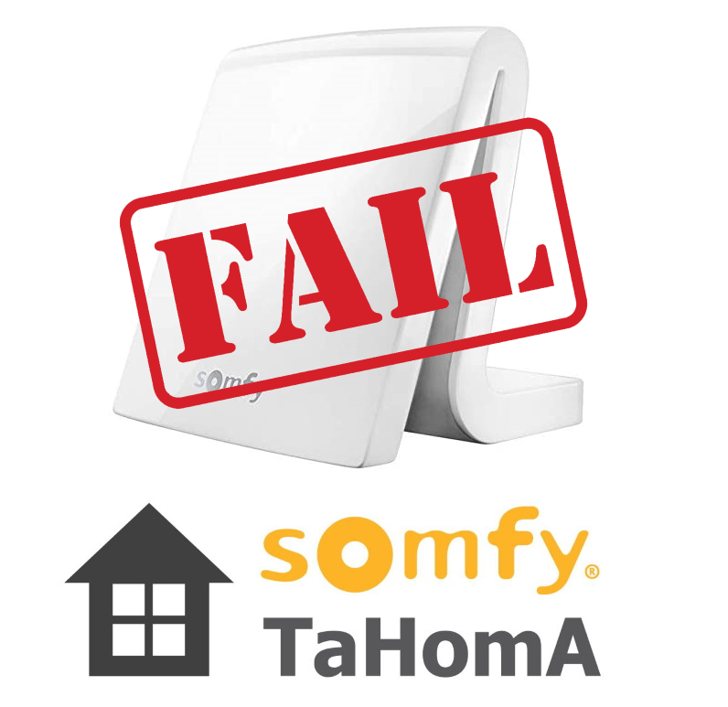

I wanted more, so I started looking at the smart home hubs.  Since I had ten Velux devices which supported the rare [IO-HomeControl](http://www.io-homecontrol.com/index.php/en/) protocol plus three Somfy Huna blinds, I thought I would try out the Somfy Tahoma hub.  Like many companies, Somfy claimed great things for their hub.  The reality was very different and the product was a huge, huge disappointment, particularly for the price point: £262!!!!

The web-based used interface is awful. Not exactly designed, but more thrown together. First, you select your dwelling (house, flat etc.) which uses some dreadful background graphics that a child could draw better. They seem to think putting badly designed icons of your devices on a badly drawn background of a house will somehow improve the experience!

You need to be very resourceful to figure out how to pair the devices as the on-screen prompts are useless. Rather than simply discovering the Velux devices, I eventually guessed that I needed to copy the settings over from my Velux remote control to the new Tahoma hub.  Given the Velux remote can auto-discover the components, why can’t the Tahoma?  

The Tahoma hub works with Google Assistant.  For example, you can open/close Velux blinds using *“Hey Google, open the bedroom blinds”*. You can even open Velux windows, but Google Assistant requests a security code to allow you to do that. I have no idea when this was set nor where to change it, so God help you if you don’t know the code!

In summary, the Somfy Tahoma is not so much a home automation hub, more a gateway to control a selection of Somfy or [IO-HomeControl](http://www.io-homecontrol.com/index.php/en/) devices, but not all of them.  Somfy’s own Huna blinds were not supported either.  I wrote a [slamming review of this awful hub on Amazon](https://github.com/DrJohnT/HomeAssistantPublicConfig/wiki/Somfy-Tahoma-Review) and returned it within 24 hours!

Somfy Tahoma really is a dead-end product!  A bear trap in the path of the unwary.

## The SmartThings diversion

> *SmartThings hub purchased 14th Nov 2019 – Superseded after 1 month – sold after 2 months*

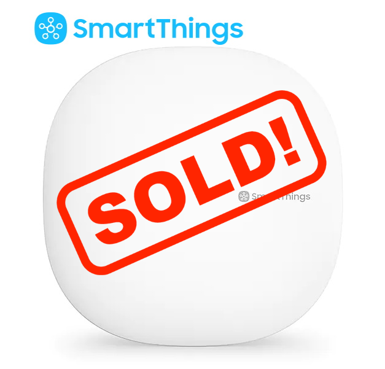

My shiny new SmartThings hub arrived in its pristine box along with a collection of matching smart plugs and sensors.  In great anticipation, I connected it up and paired the devices. 

SmartThings did have an early win. The Logitech Harmony Hub can integrate with SmartThings so it can control lights and switches.  My lounge AV is built around my aging stereo system and the Audiolab amp only has a manual power button.  I got around this by putting the amp on a SmartThings plug and always leaving it switched on.  I then added the plug to the Logitech Harmony Hub automation so that it was switched on with the rest of the devices.  However, external devices are always turned on last by Harmony as you don't control the sequence of events.  As the amp takes 20 seconds to power on, the Harmony hub has already sent the IR command to change the amp’s input before the amp is ready to receive the signal.  The SmartThings / Logitech integration solved some problems but not all.

SmartThings has this Jekyll and Hyde relationship with two apps: the new app has several missing features, so you must install the old SmartThings app as well.  What makes matters worse is that both apps are equally badly designed, and the support documentation would often describe how to use the app to achieve your purpose, but it was never clear which of the two apps they meant.  In addition, there was no web site to control your home which is odd given that SmartThings is a cloud-based system.  The only web site they do have is a badly designed developer focused site which lists your components and their configuration.

As showen in the table below, SmartThings was no better at integrating my existing hotchpotch of equipment than Google Home.

<table class="blueTable">
  <thead>
    <tr>
      <th>Category</th>
      <th>Item</th>
      <th>Qty</th>
      <th>SmartThings</th>
      <th>Google Home</th>
    </tr>
  </thead>
  <tbody>
    <tr>
      <td style="text-align: left">Audio / Visual</td>
      <td style="text-align: left">Logitech Harmony Hub Companion</td>
      <td style="text-align: right">1</td>
      <td style="text-align: center" class="green">✔</td>
      <td style="text-align: center" class="green">✔</td>
    </tr>
    <tr>
      <td style="text-align: left">Audio / Visual</td>
      <td style="text-align: left">Logitech Squeezebox Touch</td>
      <td style="text-align: right">4</td>
      <td style="text-align: center" class="pink">✘</td>
      <td style="text-align: center" class="pink">✘</td>
    </tr>
    <tr>
      <td style="text-align: left">Heating</td>
      <td style="text-align: left">Salus iT550 Controller</td>
      <td style="text-align: right">1</td>
      <td style="text-align: center" class="pink">✘</td>
      <td style="text-align: center" class="pink">✘</td>
    </tr>
    <tr>
      <td style="text-align: left">Lights</td>
      <td style="text-align: left">MiLight LED controllers</td>
      <td style="text-align: right">3</td>
      <td style="text-align: center" class="pink">✘</td>
      <td style="text-align: center" class="pink">✘</td>
    </tr>
    <tr>
      <td style="text-align: left">Plugs</td>
      <td style="text-align: left">SmartThings plugs</td>
      <td style="text-align: right">3</td>
      <td style="text-align: center" class="green">✔</td>
      <td style="text-align: center" class="green">via ST</td>
    </tr>
    <tr>
      <td style="text-align: left">Plugs</td>
      <td style="text-align: left">Belkin smart plugs</td>
      <td style="text-align: right">3</td>
      <td style="text-align: center" class="green">✔</td>
      <td style="text-align: center" class="green">via ST</td>
    </tr>
    <tr>
      <td style="text-align: left">Security</td>
      <td style="text-align: left">Risco Security Alarm</td>
      <td style="text-align: right">1</td>
      <td style="text-align: center" class="pink">✘</td>
      <td style="text-align: center" class="pink">✘</td>
    </tr>
    <tr>
      <td style="text-align: left">Sensors</td>
      <td style="text-align: left">SmartThings motion sensor</td>
      <td style="text-align: right">1</td>
      <td style="text-align: center" class="green">✔</td>
      <td style="text-align: center" class="green">via ST</td>
    </tr>
    <tr>
      <td style="text-align: left">Windows / Blinds</td>
      <td style="text-align: left">Velux Integra windows</td>
      <td style="text-align: right">5</td>
      <td style="text-align: center" class="pink">✘</td>
      <td style="text-align: center" class="pink">✘</td>
    </tr>
    <tr>
      <td style="text-align: left">Windows / Blinds</td>
      <td style="text-align: left">Velux Integra blinds</td>
      <td style="text-align: right">5</td>
      <td style="text-align: center" class="pink">✘</td>
      <td style="text-align: center" class="pink">✘</td>
    </tr>
    <tr>
      <td style="text-align: left">Windows / Blinds</td>
      <td style="text-align: left">Somfy Huna Blinds</td>
      <td style="text-align: right">3</td>
      <td style="text-align: center" class="pink">✘</td>
      <td style="text-align: center" class="pink">✘</td>
    </tr>
  </tbody>
</table>

 

To integrate the MiLight LED controllers with SmartThings, I purchased the [MiLight WiFi Boxer gateway](https://www.milight.com/milight-wifi-box/), only to realise when it arrived that I had the same piece of crap in a dark crevice in my attic somewhere. The Boxer had not worked then, and it did not work now, so I returned the new device to Amazon and ordered three [Gledopto RGBW Zigbee LED Strip Controllers](https://www.gledopto.eu/) to replace the MiLight LED controllers.  

As I work from home a lot, I wanted to be able to control my heating on a room by room basis.  My existing [Salus iT550](https://salus-controls.com/uk/product/it500/)  had a great app and web site by which I could turn the boiler on and off.  It even had a portable battery-operated thermostat so I could move it to the main room I was occupying at the time (e.g. study or lounge).  But to turn off unused rooms, I had to walk around the apartment changing the setting on each radiator. This started to become a pain, especially when I forgot to turn radiators back on and my partner would complain about the cold temperature in that room.

Since I already had an internet-controlled thermostat, I started looking for thermostatic radiator valves (TRVs) which I could pair with SmartThings and remotely switch on and off.  

## The Salus thing

> *Salus TRV purchased 19th Nov 2019 – Returned after 24 hours*

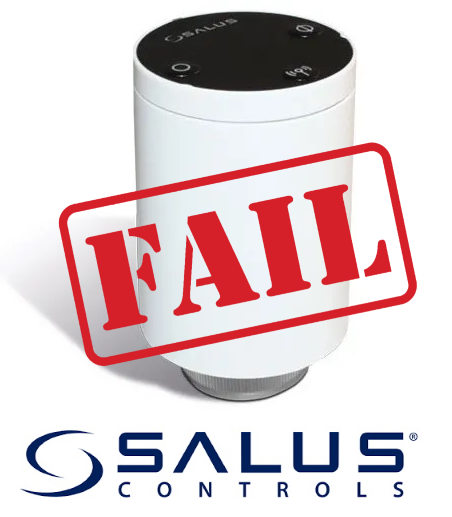

Given I had the [Salus iT550](https://salus-controls.com/uk/product/it500/), I had great hopes for the [TRV10RFM Smart Radiator Control](https://salus-controls.com/uk/product/trv10rfm/).  Although the device paired with SmartThings very easily, it simply appeared as *Thing* in the interface and was totally uncontrollable.  So, the device was returned to Amazon unwanted.

 

## The Meross monster

> *Meross TRV purchased 10th Dec 2019 - Returned after 24 hours*

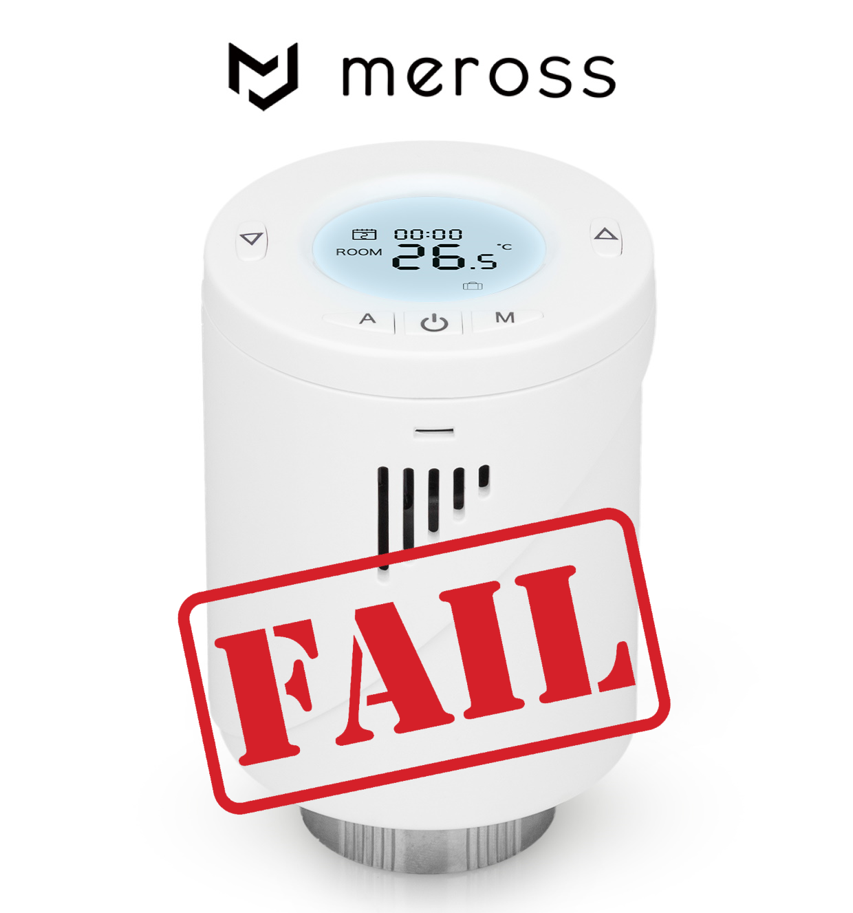

SmartThings did have a cloud to cloud integration and Meross make a big thing about their devices been controllable via IFTTT.  However, I did notice that not a single word was mentioned on any web site about the Meross TRVs been controllable in the same manner.  So, I contacted Meross product support and they provided a nebulous reply that kind of implied the TRVs were supported.   I did not like the fact the [Meross TRVs](https://www.meross.com/product/30/article/) require their own [Wi-Fi gateway](https://www.meross.com/product/31/article/), but I could live with that if they worked.  Pairing the Meross kit to their own app was easy.  However, when I came to pair SmartThings with Meross using the cloud integration, the Meross turned into a monster, destroying all my SmartThings settings making it forgot all my devices.  This was not cloud integration, it was cloud warfare!   So, the device was returned to Amazon unwanted.  Another note was sent to Meross product support telling them of their product’s failings, but I never got a reply or an apology.

## The Chromecast insurgency

> *Google Chromecast Audio x 4 purchased 18th Nov 2019 – Still on the journey*

Years ago, I had invested in a multiroom audio system. I had a Logitech Squeezebox Touch in every room streaming music from a central Logitech Music Server (LMS).  Of course, each Squeezebox Touch needed an amplifier and speakers to work and the LMS needed the server on which to run. The whole set up was reasonably expensive, but in my view far cheaper than the equivalent Sonos system and far more flexible.  The LMS had a range of dedicated tinkers that kept providing extensions for the server such as Spotify and [Tidal](https://www.tidal.com) integration.  The [Netgear ReadyNAS](https://www.netgear.com/business/products/storage/readynas/) server could run not only LMS but also Plex. 
Spurred on by the announcement that Google had stopped their manufacture, I purchased a couple of [Google Chromecast Audio](https://www.whathifi.com/google/chromecast-audio/review) devices and was amazed to find just how good they were! Firstly, they have a *full dynamic range mode* so that they can drive my stereo system to an acceptable level. Also, to my surprise they have a group mode so that the same music can be streamed to several rooms (i.e. multiroom). 

## Home revolution 

> *Raspberry Pi to run Home Assistant purchased 14th Dec 2019 – Still on the journey*

Having been disappointed with SmartThings, I decided it was time to roll up my sleeves and write some serious code.  To that end I purchased Raspberry Pi and installed [Home Assistant](https://www.home-assistant.io/).  To my surprise, apart from a little YAML, there was not a lot of things for which I needed to write code.   [Home Assistant](https://www.home-assistant.io/) supports so many things out of the box and discovers many more automatically that there is little need to resort to coding.  Soon many more of my devices were under my control and the list keeps growing by the day.  

Although [Home Assistant](https://www.home-assistant.io/) (HA) had usurped SmartThings crown, at this point I still used SmartThings as my Zigbee and Z-Wave gateway.  However, after a while the HA / SmartThings integration started getting unreliable, often displaying a fleeting message *“Call to the SmartThings server failed”*. I partly blamed this on the Meross Monster, but I did hanker after a non-internet-based solution to my Zigbee communication.

## The Elelabs shield wall

> *Elelabs Shield purchased 4th Jan 2020 – Currently collecting dust in the attic*

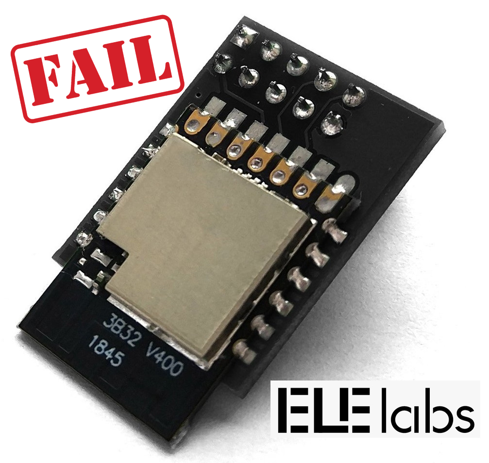

I purchased the [Elelabs Zigbee Raspberry Pi Shield](https://elelabs.com/products/elelabs-zigbee-shield.html) to replace SmartThings as a Zigbee hub.  I had presumed it would be plug and play, but the device simply would not work.   I spent night after night screwing around with docker configs, building and rebuilding my machine, but I just could not get it to work.  After many interactions with Elelabs support and some 40 hours (yes 40 hours!!!) of wasted time, I gave up.  Clearly, they call the product shield for a reason: shield wall, a blockage in your path!
I got my money back via PayPal refund.  Their support guy emailed me telling me to keep the device and asked if I would check out their new firmware when it became available.  As if!

## The Conbee Samaritan

> *Conbee II purchased 25th Jan 2020 - Still on the journey*

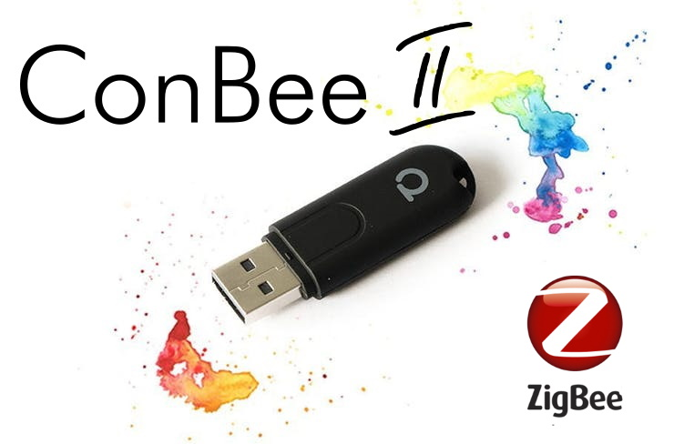

After the absolute disaster of the Shield, the Conbee II was like meeting the Samaritan on the road to Damascus.  Within 30 minutes, all my Zigbee devices were on-line and available.  I have to say, deConz has an odd web interface and the Zigbee device map looks impressive but is not at all useful.  Also frustrating is how it categorises some devices as lights when they are switches.  But all these shortcomings are forgivable in a product that just works out of the box.

## The Active selling frenzy

> *Velux Active gateway purchased 13th Jan 2020 - Still on the journey*

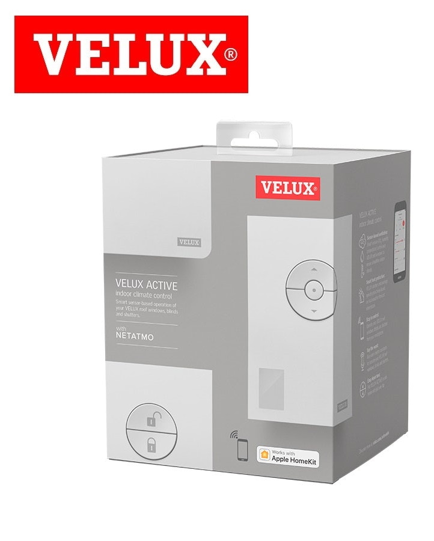

I had hankered after a way to control my Velux Integra roof windows for quite a while.  But I baulked at the idea of spending £180 on the Velux Active gateway that would allow me to control these devices when I already had a set of perfectly adequate remote controls (albeit not integrated with HA).  Then it occurred to me.  Each window came with a Velux KLR200 control pad. One control could control all five windows and five blinds.  So, I only needed to keep one controller as a backup to the gateway.  A quick check on eBay indicated that I could potentially sell each KLR200 for £70 or more.   So, the eBay selling frenzy began.  The redundant SmartThings hub was sold alongside the MiLight controllers and various bits and pieces from my loft. 

## Farewell sweet Touch

> *Logitech Squeezebox Touch x 6 purchased 2011 / 2012  - Sold Feb 2020*

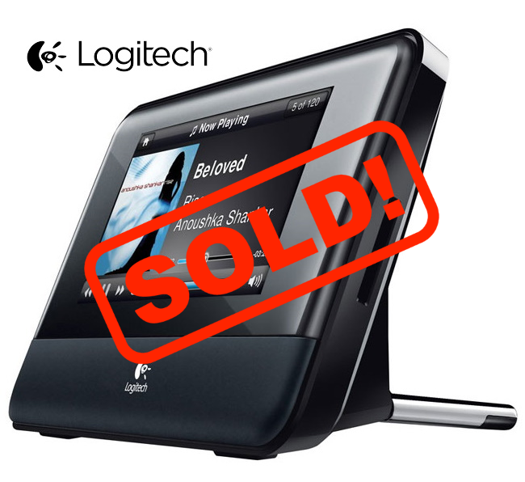

The next victim was my old multiroom audio system.  After a few months of running both systems in parallel I found I hardly used Logitech system anymore; streaming [Tidal](https://tidal.com/) to Chromecast Audio was so, so convenient. Therefore, the Logitech Squeezebox Touch units were all sold and my use of [Plex](https://www.plex.tv) media server expanded to encompass my own music collection. I always had a love/hate relationship with the [Logitech Music Server (LMS)](https://en.wikipedia.org/wiki/Logitech_Media_Server), so I was very glad to see it go!  Logitech stopped selling the Squeezebox equipment a long time ago, but there was a dedicated following and heavy demand on eBay.  I even managed to sell two broken devices for spare parts.  I later heard from the buyer who had managed to fix them.  Good on him!  

## Goodbye faithful Belkin

> *Belkin smart plugs x 3 purchased 2015 / 2016 - Sold Feb 2020*

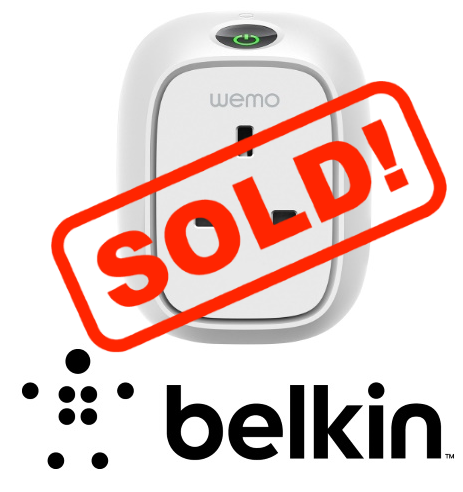

With monies in my eBay bank, I decided to rationalise my technology.  So I replaced the aging Wi-Fi based Belkin devices with SmartThings Zigbee smart plugs.  There are cheaper smart plugs, but I knew the SmartThings devices were reliable as I had three already.  The ridiculous thing is that I got more for selling the five-year-old Belkin smart plugs than I paid for brand-new SmartThings replacements.  Go figure!

## Secure travels

> *Risco LightSys 2 Security & Fire Alarm purchased Nov 2016 - Still on the journey*

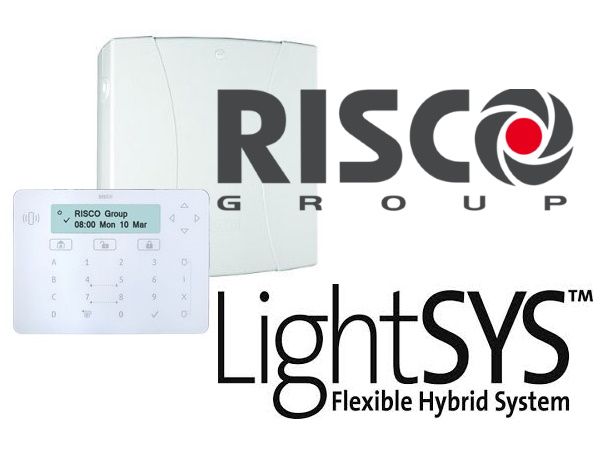

I really thought that integration of the Risco security alarm would be the last thing I managed, but a [Home Assistant enthusiast](https://github.com/lucacalcaterra/risco-mqtt-bridge) has done an integration, so the installation could not be easier.  

Now, when the alarm is set, lights around the apartment are automatically turned on and off after sunset to give the impression someone is at home.  I can also switch the alarm off remotely when a new cleaner turns up.

## The Wiser road to a better climate

> *Drayton Wiser TRVs x 7 purchased 7th Feb 2020 - Still on the journey*

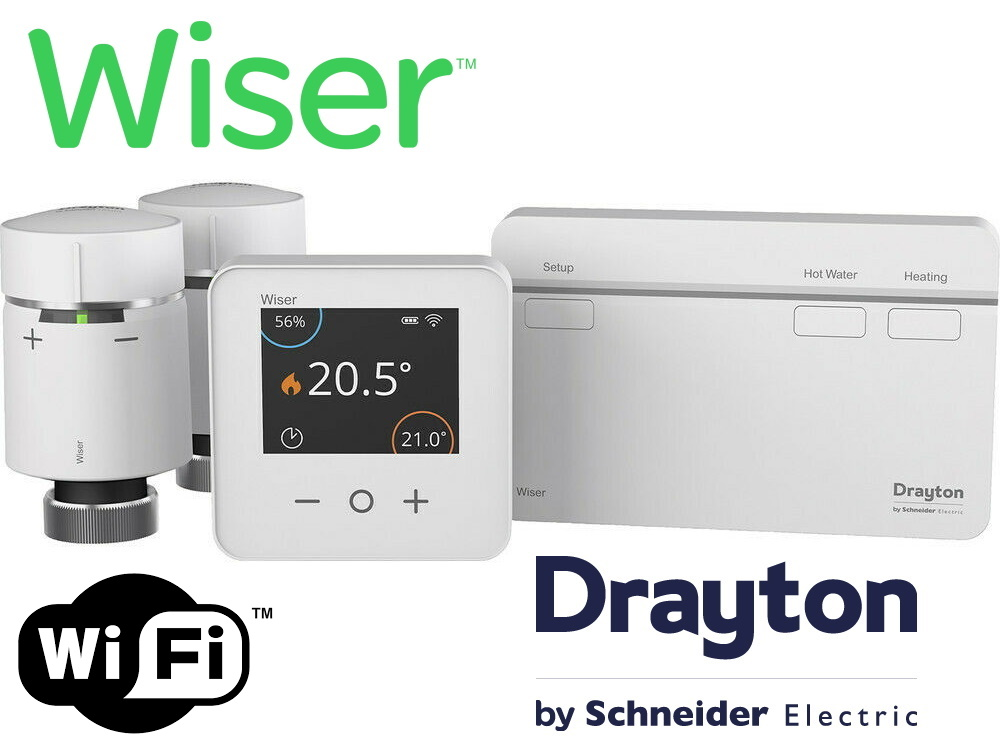

Like most homes, the heating was either all or nothing. That is, once the boiler is on, then all the radiators get hot regardless.  Obviously thermostatic radiator valves can reduce the temperature in certain rooms, but that does not cater for the following scenarios: 

<ul>
<li>When working from home, I want to switch off all the radiators in the rest of the home.</li>
<li>When my partner is home alone, only the bedroom needs heating, so switch off all the radiators in the rest of the home</li>
<li>When the family is about, I want the whole home heated</li>
</ul>

I found that I was constantly walking around the flat turning the radiator valves on and off manually.  Sometimes I would forget and my partner complained she was cold.  Clearly I needed remote controlled thermostatic values on each radiator which would allow me to set the temperature of each room individually.

After looking at buying individual TRVs like the Salus and Meross described above, I eventually took the plunge for an integrated system from [Drayton](https://wiser.draytoncontrols.co.uk/) which is controlled through [Home Assistant](https://www.home-assistant.io/) by the excellent [Wiser Heating Component](https://github.com/asantaga/wiserHomeAssistantPlatform).

I now have room by room heating control which adapts to where we are and what we are doing. 

## Sweet, sweet Harmony

> *Logitech Harmony Companion & Hub purchased 2014 - Still on the journey*

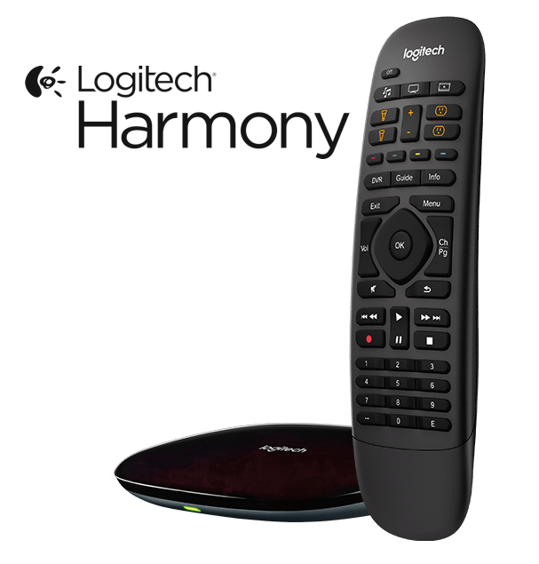 

My lounge AV is built around my aging stereo system.  Although the [Audiolab](https://www.audiolab.co.uk/) amplifiers do have a remote control, they only have a manual power button.  The [Logitech Harmony Hub Companion](https://www.logitech.com/en-gb/product/harmony-hub) was a Godsend, but it only solved some of the problems.  Obviously, it did not power on the [Audiolab](https://www.audiolab.co.uk/) units, but worse did not change the TV input correctly when changing source.  This is particularly annoying as the Harmony Hub does know how to send a IR command to select a particular input on the TV, but does not allow you to select it in their app.

[Home Assistant](https://www.home-assistant.io/) automations allowed me to solve all the outstanding issues with the Harmony Hub.  I set up automations for each state change event that needed an input change.  For example, when changing from watching a Blu-ray disk to watching the Freesat PVR needs a different HDMI port to be selected. An automation would detect the change and have the Harmony Hub send the correct IR sequence.  Some automations required a delay while the peripheral warmed up.  For example, the TV takes approximately 10 seconds to switch on, so I had to delay the HDMI port change request until it was ready.  This I did by simply sending the same request multiple times, after a few second delay. 

The final problem of the manual switches on the [Audiolab](https://www.audiolab.co.uk/) equipment was solved by a Smart Plug.  I simply leave the [Audiolab](https://www.audiolab.co.uk/) equipment switched on and have the Smart Plug turn on the power when requested by a Harmony Hub state change.  

The result is that a collection of new and aging equipment works together flawlessly.

## Fanning the winds of change

> *Xiaomi Aqara Temperature and humidity sensors purchased Jan 2020 – Still on the journey*

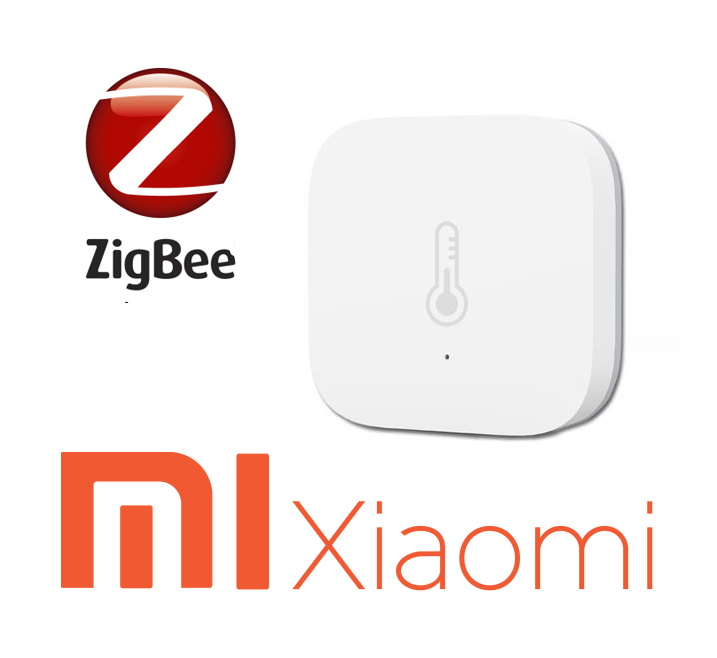 

The bathroom fan used go on and off with the light switch. This was particularly annoying as the fan is noisy, especially at night. Often, we would disable the fan with the tri-pole switch, but this meant people had to proactively remember to flick on the switch before having a shower - which they never did! Also, after having a shower, the fan goes off with the light switch, thus leaving behind a steamy bathroom.

So I replaced the tri-pole switch with a [Sonoff](https://sonoff.tech/product/wifi-smart-wall-swithes/tx-series) and put a tiny [Xiaomi Aqara temperature and humidity sensor](https://xiaomi-mi.com/sockets-and-sensors/aqara-temperature-and-humidity-sensor/) in the bathroom.  Now [Home Assistant](https://www.home-assistant.io/) switches on the bathroom fan when the humidity goes over 75% and off again when it drops below this point. The result is that the fan only comes on when it is needed. No more, no less. No more noisy fans or steamy bathrooms!

## Fruitless Bluefruit 

> *Adafruit Bluefruit LE Sniffer purchased 16th Feb 2020 – Fruitless journey*

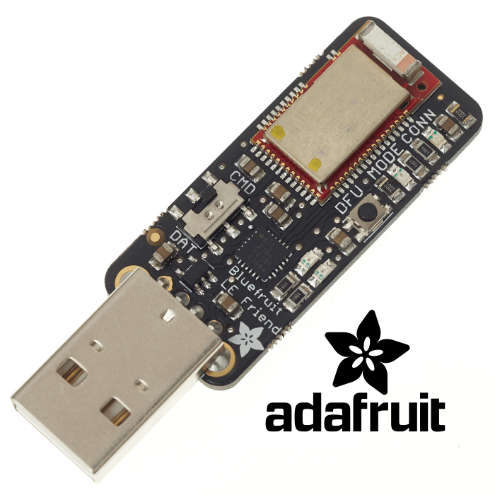

Given my success to date of my home automation journey with [Home Assistant](https://www.home-assistant.io/) , I was really hoping that I could tame the Somfy Huna Bluetooth blinds.  However, the task of reverse engineering the Bluetooth LE commands has so far proved beyond me.  I tried the nRF app from Nordic Telecom plus Wireshark and the Adafruit Bluefruit LE Sniffer for BLE 4.0, but the Bluetooth traffic is so chatty, I cannot isolate the commands that control the blinds.  Ah well, perhaps for another day when I have time on my hands.  Perhaps during a period of lockdown...

## What's the WAF?

> *Xiaomi Aqara double wall switch purchased 20th March 2020 - Still on the journey*

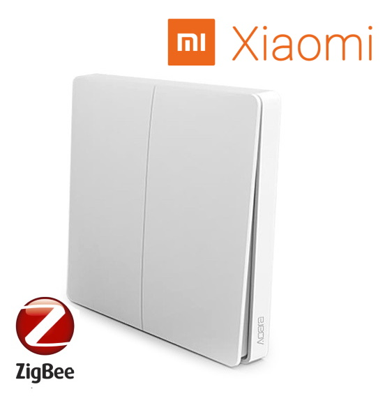

Many in the home automation community talk about WAF, the *Wife Acceptance Factor*.  Well, by far my partner's favourite addition to the apartment is the [Xiaomi Aqara double wall switch](https://xiaomi-mi.com/sockets-and-sensors/remote-switch-for-aqara-smart-light-wall-switch-double-key/) which I have configured to performs several actions:
* Left hand switch:
    * Single click - switches the hall LED strip lights on/off (WHITE)
    * Double click - switches the hall LED strip lights on/off (RED)
    * Long press - switches on/off the central heating and the Google Mini announces the status: *The central heating has now been turned ON*
* Right hand switch:
    * Single click - switches the lounge LED strip lights on/off (WHITE)
    * Double click - switches the lounge LED strip lights on/off (RED)
    * Long press - switches on/off the hot water and the Google Mini announces the status: *The hot water has now been turned ON*

## The Assistant re-joins the journey

My success with [Home Assistant](https://www.home-assistant.io/) has allowed me to enable voice activated control over all the devices in my apartment via Google Assistant.

My outstanding bug bear is that [Google Home](https://store.google.com/gb/product/google_home) does not support [Tidal](https://tidal.com/) as a native music provider whereas they do support Spotify, Deezer and their own subscription services YouTube & Google Play Music. So, I cannot simply ask Google Assistant to play something for me from Tidal's vast catalogue. To solve this problem, I am working with Ryan Meek to expand the [Plex Assistant](https://github.com/maykar/plex_assistant) to encompass music as well as movies. 

Ultimately, [Home Assistant](https://www.home-assistant.io/) has made numerous improvements to the way we live, making our lives easier in many ways. 

The table below lists all the things I have now integrated with Home Assistant. 
 A full write up of my final set of integrations and automations can be found on my [Home Assistant GitHub repo](https://github.com/DrJohnT/HomeAssistantPublicConfig).

<table class="blueTable">
  <thead>
    <tr>
      <th>Category</th>
      <th>Item</th>
      <th>Qty</th>
      <th>Home Assistant</th>
      <th>Google Assistant</th>
    </tr>
  </thead>
  <tbody>
    <tr>
      <td style="text-align: left">Audio / Visual</td>
      <td style="text-align: left">Logitech Harmony Hub Companion</td>
      <td style="text-align: right">3</td>
      <td style="text-align: center" class="green">✔</td>
      <td style="text-align: center" class="green">via HA</td>
    </tr>
    <tr>
      <td style="text-align: left">Audio / Visual</td>
      <td style="text-align: left">Google Chromecast Audio</td>
      <td style="text-align: right">4</td>
      <td style="text-align: center" class="green">✔</td>
      <td style="text-align: center" class="green">✔</td>
    </tr>
    <tr>
      <td style="text-align: left">Audio / Visual</td>
      <td style="text-align: left">Google Chromecast Video</td>
      <td style="text-align: right">3</td>
      <td style="text-align: center" class="green">✔</td>
      <td style="text-align: center" class="green">✔</td>
    </tr>
    <tr>
      <td style="text-align: left">Heating</td>
      <td style="text-align: left">Drayton Wiser Heating, Hot Water and TRVs</td>
      <td style="text-align: right">8</td>
      <td style="text-align: center" class="green">✔</td>
      <td style="text-align: center" class="green">via HA</td>
    </tr>
    <tr>
      <td style="text-align: left">Lights</td>
      <td style="text-align: left">Gledopto RFBW Zigbee LED Controllers</td>
      <td style="text-align: right">3</td>
      <td style="text-align: center" class="green">✔</td>
      <td style="text-align: center" class="green">via HA</td>
    </tr>
    <tr>
      <td style="text-align: left">Security</td>
      <td style="text-align: left">Risco Security Alarm</td>
      <td style="text-align: right">1</td>
      <td style="text-align: center" class="green">✔</td>
      <td style="text-align: center" class="green">via HA</td>
    </tr>
    <tr>
      <td style="text-align: left">Sensors</td>
      <td style="text-align: left">SmartThings motion sensor</td>
      <td style="text-align: right">1</td>
      <td style="text-align: center" class="green">✔</td>
      <td style="text-align: center" class="green">via HA</td>
    </tr>
    <tr>
      <td style="text-align: left">Sensors</td>
      <td style="text-align: left">Xiaomi humidity and temperature</td>
      <td style="text-align: right">2</td>
      <td style="text-align: center" class="green">✔</td>
      <td style="text-align: center" class="green">via HA</td>
    </tr>
    <tr>
      <td style="text-align: left">Sensors</td>
      <td style="text-align: left">Xiaomi Mi Flora flower sensor</td>
      <td style="text-align: right">1</td>
      <td style="text-align: center" class="green">✔</td>
      <td style="text-align: center" class="green">via HA</td>
    </tr>
    <tr>
      <td style="text-align: left">Switches</td>
      <td style="text-align: left">SmartThings plugs</td>
      <td style="text-align: right">7</td>
      <td style="text-align: center" class="green">✔</td>
      <td style="text-align: center" class="green">via HA</td>
    </tr>
    <tr>
      <td style="text-align: left">Switches</td>
      <td style="text-align: left">Sonoff WiFi wall switch</td>
      <td style="text-align: right">1</td>
      <td style="text-align: center" class="green">✔</td>
      <td style="text-align: center" class="green">via HA</td>
    </tr>
    <tr>
      <td style="text-align: left">Switches</td>
      <td style="text-align: left">Xiaomi Aqara double switch</td>
      <td style="text-align: right">1</td>
      <td style="text-align: center" class="green">✔</td>
      <td style="text-align: center" class="green">via HA</td>
    </tr>
    <tr>
      <td style="text-align: left">Switches</td>
      <td style="text-align: left">Xiaomi smart button</td>
      <td style="text-align: right">2</td>
      <td style="text-align: center" class="green">✔</td>
      <td style="text-align: center" class="green">via HA</td>
    </tr>
    <tr>
      <td style="text-align: left">Windows / Blinds</td>
      <td style="text-align: left">Velux Integra windows</td>
      <td style="text-align: right">5</td>
      <td style="text-align: center" class="green">✔</td>
      <td style="text-align: center" class="green">via HA</td>
    </tr>
    <tr>
      <td style="text-align: left">Windows / Blinds</td>
      <td style="text-align: left">Velux Integra blinds</td>
      <td style="text-align: right">5</td>
      <td style="text-align: center" class="green">✔</td>
      <td style="text-align: center" class="green">via HA</td>
    </tr>
    <tr>
      <td style="text-align: left">Windows / Blinds</td>
      <td style="text-align: left">Somfy Huna Bluetooth blinds</td>
      <td style="text-align: right">3</td>
      <td style="text-align: center" class="pink">✘</td>
      <td style="text-align: center" class="pink">✘</td>
    </tr>
  </tbody>
</table>
 

## Journey's end?

> *“Do adventures ever have an end? I suppose not. Someone else always has to carry on the story.”*  Quote: JRR Tolkien

I cannot say that my home automation journey is over. I have several territories still to conquer, so new adventures do await...

If you would like to know exactly how I use [Home Assistant for Home Automation click this link](https://github.com/DrJohnT/HomeAssistantPublicConfig).

## Comment on this blog post

 &nbsp;

          
### Trademark Legal Notice
<small>This blog is not created, developed, affiliated, supported, maintained or endorsed by Home Assistant. All product names, logos, brands, trademarks and registered trademarks are property of their respective owners. All company, product, and service names used in this repo are for identification purposes only. Use of these names, logos, trademarks, and brands does not imply endorsement.</small>

