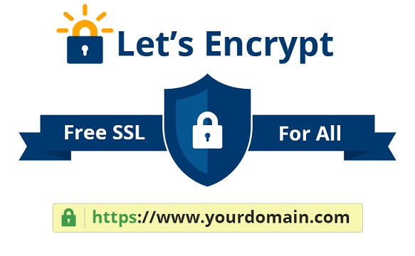

# Let's Encrypt everything using yourdomain.com

Like many IT guys, I have owned my own domain for years.  Having recently upgraded my router to something more capable, I started looking at ways to encrypt traffic to make my pfSense router and Home Assistant server accessible remotely.
 
Behind my motivation was the fact that the laptop I spend most time on belongs to my client and they draconian security software which blocks access to unencrypted websites, including those on my own network.  So for peace of mind and for very practical reasons I started looking into getting SSL certificates for every server on my home network, regardless of whether they were publicly accessible.  Perhaps I got carried away, but now I have proper SSL certificates for:

* pfSense Firewall Router
* Home Assistant
* Unifi Network Controller 
* Portainer
* Plex (for internal access)

The only bad apple on my network is the Netgear ReadyNAS RN212 which unfortunately only supports self-signed certicates.  

So in this blog I will show how to setup automatically renewing Let's Encrypt certificates for Home Assistant, Unifi, Portainer and Plex.

## pfSense Firewall Router 

I have the excellent [Netgate SG-1100](https://store.netgate.com/pfSense/SG-1100.aspx) router running pfSence.  To say pfSence is a capable firewall is an understatement!  There are so many add-ins that the list is mind boggling.  I had planned to install a Pi-Hole ad-blocking server once I got a new router.  No need.  pfSence has ngBlocker built in which works at the firewall network packet level unlike Pi-Hole which works at the DNS level.  So far more effective than Pi-Hole and built-in.

I will not illucidate how to install automatically renewing Let's Encrypt certificates on the pfSense router because it is expertly covered by ceoS3C in his YouTube video [Enable SSL for pfSense 2.4 - Quick & Easy!](https://www.youtube.com/watch?v=6XMZ0gUZeTc&t=33s)   

However, I would say if you are looking for a new router, you should take a serious look at the [Netgate SG-1100](https://store.netgate.com/pfSense/SG-1100.aspx) but be warned - get it from a European distributor - otherwise you will need to pay import duty. Ouch!

